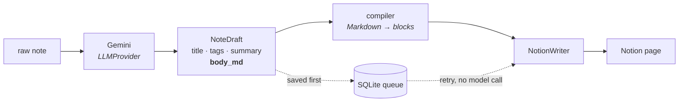
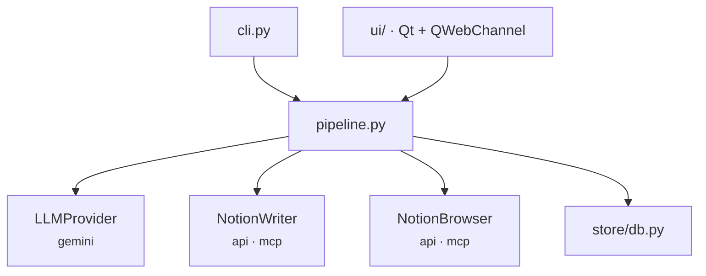

<p align="center">
  <picture>
    <source media="(prefers-color-scheme: dark)" srcset="images/lapidary-2d-dark.png">
    
  </picture>
</p>

<p align="center">
  Paste a messy note. Gemini cleans it up. It lands in Notion as a structured page.
</p>

---

## How it works



**The model returns Markdown, never Notion block JSON.** Notion's block schema
is verbose and trap-laden — 2000 characters per rich-text element, 100 children
per request, two levels of nesting. No model produces that reliably. So the
model does one job, and a deterministic, pure, heavily-tested compiler turns
Markdown into blocks.

That gives one rule you cannot break: **`MARKDOWN_SPEC` in `llm/prompts.py` and
`notion/compiler.py` travel together.** Syntax allowed in the prompt but
unimplemented in the compiler is discarded at compile time, silently.

The note enters SQLite *before* the model is called and the draft is saved
*before* the Notion write. A failed publish then costs a retry, not the note
and not 40 seconds of inference — `notemcp --retry` re-sends every pending
draft without touching the model.

## Architecture



Three ports, swapped by configuration; callers never know which is active.
`NotionWriter` and `NotionBrowser` are separate — publishing and navigating
your page tree are different jobs — but share one transport.

`api` compiles Markdown into blocks and owns the real complexity (batching,
size limits, retries). `mcp` sends Markdown to Notion's own MCP server,
**skipping the compiler**: more syntax, less control, and it needs Node, so it
does not work from a packaged build. `api` is the default.

**Destinations**, chosen per note: a row in a Notion database, or a child page
of any page you pick by walking the tree (`--parent "College/Calculus I"`).
A standalone page has no columns, so type/tags/summary become a callout at the
top.

---

## Getting the two keys

**Notion** — go to [notion.so/my-integrations](https://www.notion.so/my-integrations),
create a **new internal integration**, and copy its token (it starts with
`ntn_`). Give it the *Read*, *Update* and *Insert content* capabilities.

Then open the Notion page you want everything written under, click `···` →
**Connections** → add your integration. **This step is not optional**: without
it the API answers `404` even with a perfectly valid token, and that is the
single most common setup failure. The page's id is the last chunk of its URL.

**Gemini** — go to [aistudio.google.com/apikey](https://aistudio.google.com/apikey)
and create an API key. The free tier is enough for this: notes are short, and
one note is one request. It is rate-limited rather than billed, so the failure
you may eventually meet is a `429`, which the app reports as such.

## Run it

```bash
python3.11 -m venv .venv
.venv/bin/python -m pip install -e ".[dev,ui]"
```

Put the three lines in a `.env` at the project root:

```bash
NOTION_TOKEN=ntn_...
NOTION_PARENT_PAGE_ID=...
GEMINI_API_KEY=...
```

```bash
notemcp-ui                         # desktop app
notemcp "a loose note"             # or a file path, or stdin
notemcp note.txt --dry-run         # format and print, write nothing
notemcp --retry                    # re-send drafts that never published
notemcp --doctor                   # diagnose config, SDK, providers
```

Runs on `gemini-3.5-flash-lite` by default; `--provider gemini:<model>` overrides.

Install it as a real desktop app, icon and all:

```bash
.venv/bin/python -m pip install -e ".[ui,build]"
.venv/bin/python packaging/install.py
```

---
